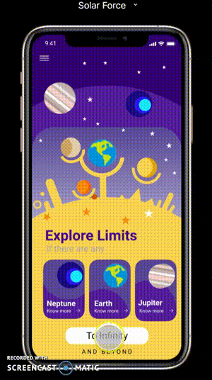

# Solar Force
The Planets Align Here

## Submitted By : 
Team Solar Force

### Team Members : 
- Shloka Lakka Reddy
- Nidhi Raniyer
- Ishita Datta

## Idea
To build a Space blogging application for acquiring quick data on all matters on space science, available in the public domain, interweaving both fact and fiction for a wholesome peep into the world beyond our world.

## UI Design Submission
Software used: Figma

#### Links for the submission:
- View the UI Design here : https://www.behance.net/gallery/101767233/Solar-Force
- Public Link To The Prototype for Demo : https://www.figma.com/proto/69qkJ6EADAYAS4gOCM7aP2/Solar-Force?node-id=5%3A79&viewport=221%2C197%2C0.07909148931503296&scaling=scale-down
- (To view gifs and other animations included in the Figma project please view the Project Prototype)
  
### Write-up on the approach taken for the UI Design Idea
When we look at the sky, we are forever enchanted by the moon and the stars and planets. Even in this hitech age, the solar system remains an enigma. Our aim is to provide a captivating  interactive interface, to dive into the real world of planets, to reach the final frontier of space research and enjoy the mix of fact and fiction generated by the _'Solar Force'_. A total of 38 screens were created to cover most aspects of the app and the app mockups were created using Figma plugins and Vectary 3D.

## App Dev Submission
Language Used: Dart (Flutter)

- A Youtube video link explaining all the features of the developed application : https://www.youtube.com/watch?v=icLVuLaaDg8
- The apk of the application is in the root directroy of this repository
- Source code of the entire application is in the root directory
---
Developed For AppSprint '20.
